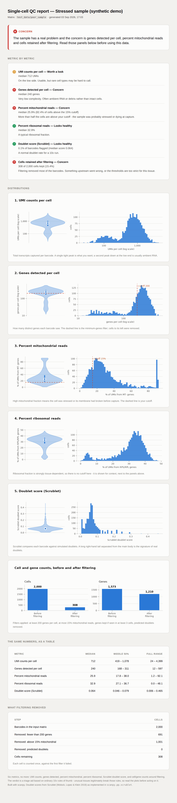

# sc-qc-report

Point this at a 10x filtered matrix folder and it tells you, in one HTML file, whether the sample is worth analysing.



The report above is the synthetic poor quality sample bundled with this repo. The file itself is [examples/example_report.html](examples/example_report.html). Everything is embedded in it, so you can email it or drop it in Slack and it opens anywhere.

## The six metrics

| Metric | Why it matters |
| --- | --- |
| UMI counts per cell | How deeply each cell was sequenced. Low counts mean RNA capture went badly, and rare populations will be hard to call. |
| Genes detected per cell | How complex each barcode is. A barcode with very few genes is usually ambient RNA or debris rather than a cell. |
| Percent mitochondrial reads | Cells that were stressed or already broken open at capture lose cytoplasmic RNA, so what is left reads as mitochondria heavy. |
| Percent ribosomal reads | Strongly tissue dependent, so it is context rather than a pass or fail. Read it alongside gene complexity. |
| Doublet score | Two cells under one barcode look like a novel cell type in the clustering. Scrublet scores every barcode against simulated doublets. |
| Cells and genes before and after filtering | Shows how much of the sample you lost and which filter took it. Losing most of your barcodes points at a problem before sequencing. |

Each metric gets a violin and a histogram. A plain language verdict at the top says whether the sample looks healthy and, if not, which metric is the concern.

## Running it

```bash
pip install -r requirements.txt
python run_qc.py path/to/filtered_feature_bc_matrix --out qc_report.html
```

No data to hand? `python make_test_matrix.py test_data/demo --quality poor` writes a synthetic 10x folder you can point at. Tested on Python 3.11.

## A note on the thresholds

The cutoffs are the usual 10x rules of thumb, not validated numbers. 200 genes per cell and 15% mitochondrial reads are sensible for PBMCs and wrong for plenty of other tissues. Heart, kidney and tumour samples often sit well above 15% mitochondrial as normal biology. Change them with `--min-genes` and `--max-pct-mito`, which move the filtering and the verdict together. Treat the verdict as triage, not as a decision.

MIT licensed. See [LICENSE](LICENSE).

Built with Claude Code. The QC logic and thresholds are mine.
